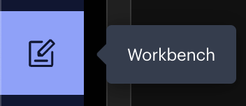
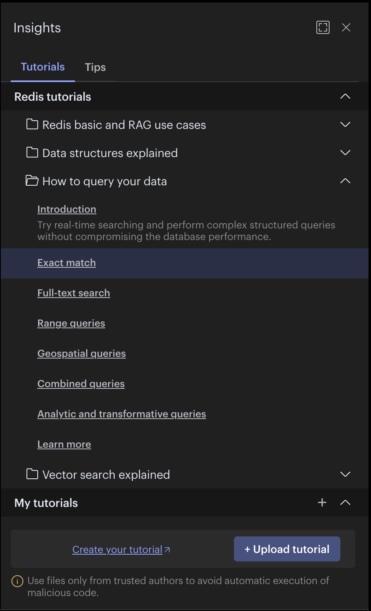
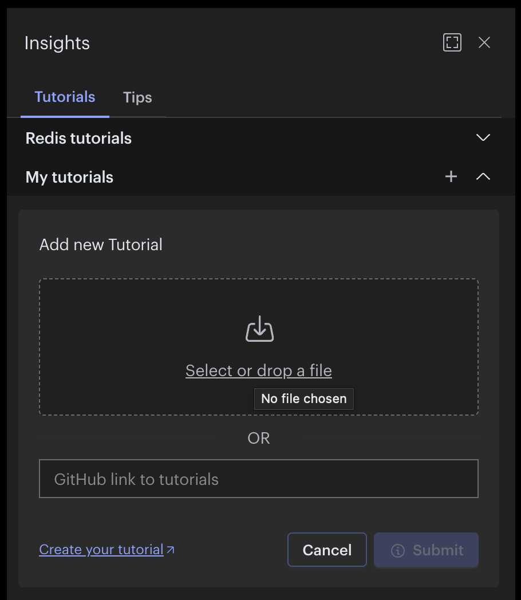
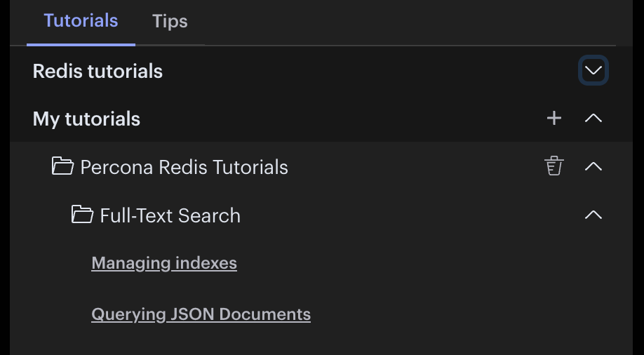

# Using Custom Tutorials in RedisInsight

This repository has several tutorials to learn Redis/Valkey located in the `./redisinsight` folder. At the very least, you will need a redis-stack instance running, and RedisInsight installed.

I recommend using the data generator used to generate fake data in this tutorial.

[Rust Data Generator](https://github.com/riveraja/rdg)

We will not include instructions on how to install Docker or the RedisInsight app.

## Start the redis-stack with Docker

```bash
docker run -d --name redis-stack -p 6379:6379 -p 8001:8001 redis/redis-stack:latest
f762c37de6110e1441fc297420938b36a5ada2248efad1c9dfd106de9276e6f7
```

## Download the tutorial

Install git in this step.

```bash
git clone https://github.com/riveraja/valkey-how-tos
```

## Upload the tutorial to RedisInsight

Select Workbench, then click Explore or light bulb icon on the upper right corner.


Insights already has sample tutorials from the application. We need to collapse these default tutorials to see the Upload button.


Click on the +Upload tutorial button and then follow instructions to upload the zip file.

The zip file is located in `valkey-how-tos/redisinsight/percona-search-tutorials.zip`.

Once you click `Submit`, the custom tutorials will be loaded.


## Using the data generator binary

Generate some fake data.

```bash
./rs-data-generator -t json -c 10000 -b 1000
```

## Follow the tutorials

Follow the links in the tutorial. First create the index before following the querying JSON tutorial.

## Contributing

Feel free to contribute by sending a pull request.
